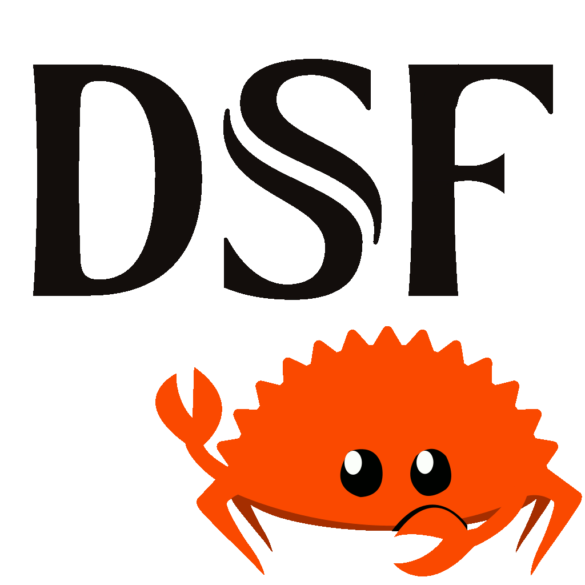

<!-- markdownlint-disable MD033 -->
#  DSD Stream File #

DSF (DSD Stream File) support in Rust. DSF files are a high-resolution
audio format that contain lossless 1-bit audio stream in delta sigma
modulation aka Direct Stream Digital (DSD). The format is intended for
1-bit DSD DACs.

This library is used by the
[`dsd`](https://gitlab.com/danieljrmay/dsd) project which provides
executables for inspecting and playing DSF files.

## References ##

* [DSF file format
specification](https://dsd-guide.com/sites/default/files/white-papers/DSFFileFormatSpec_E.pdf)
